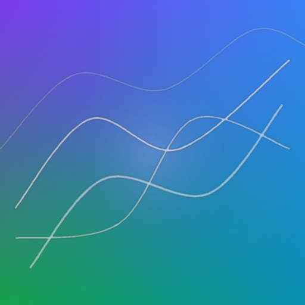
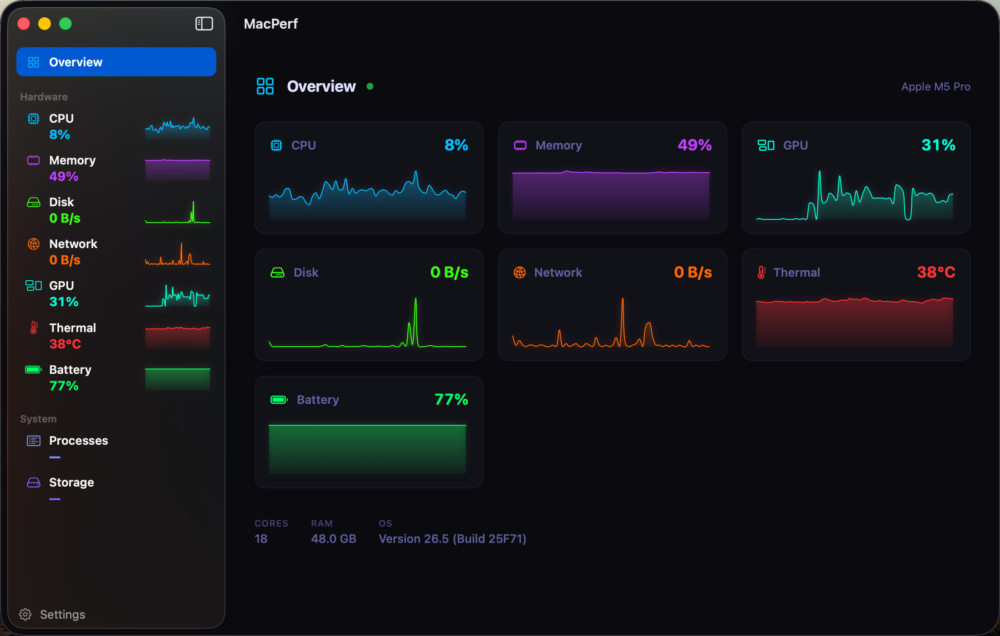
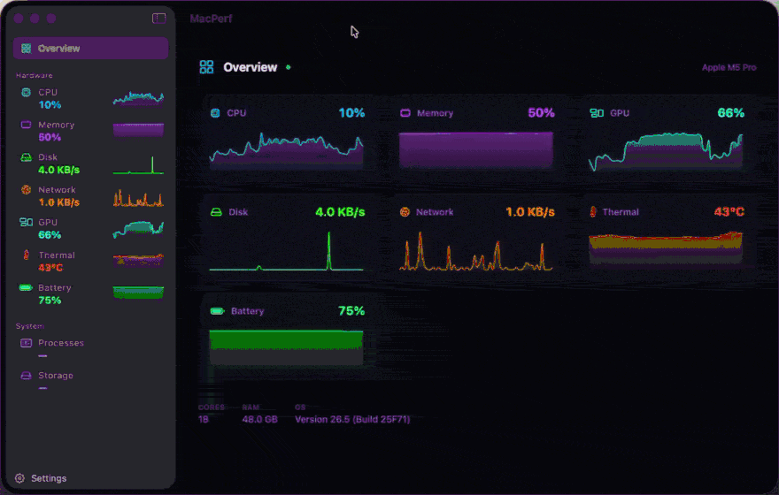
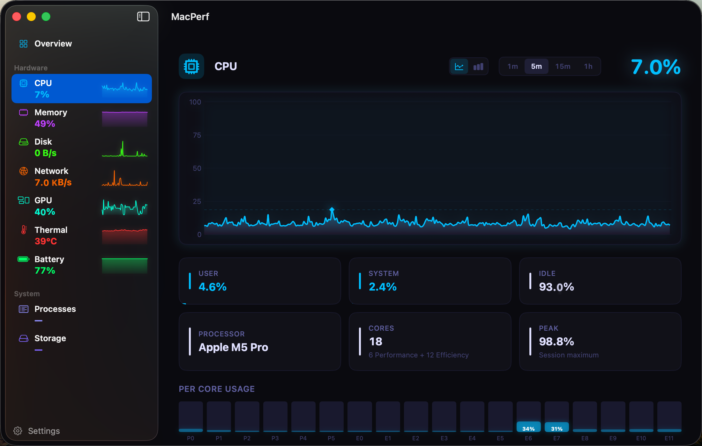
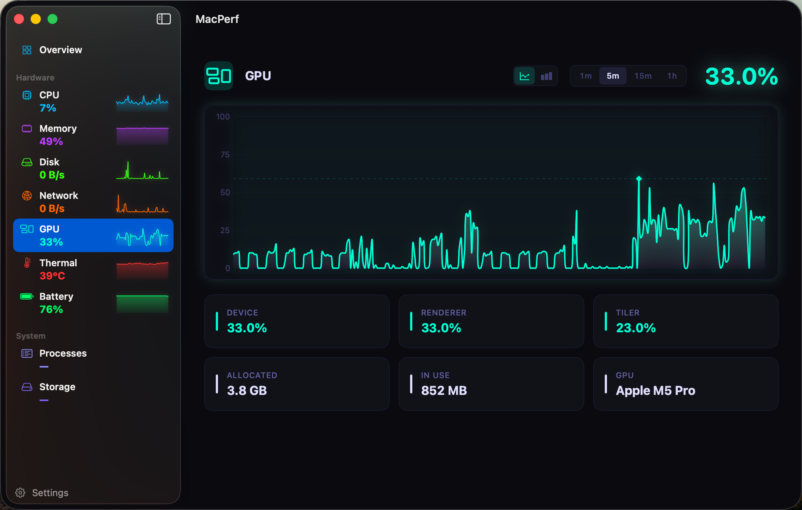
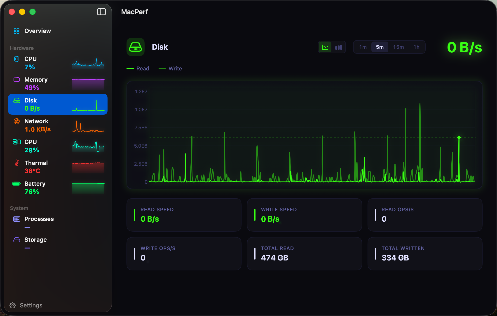
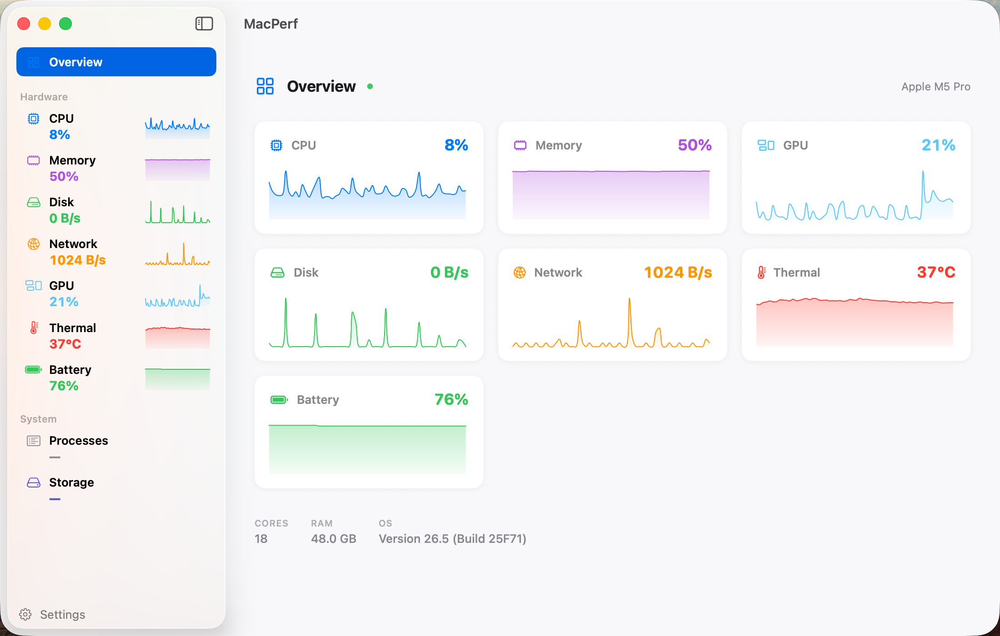
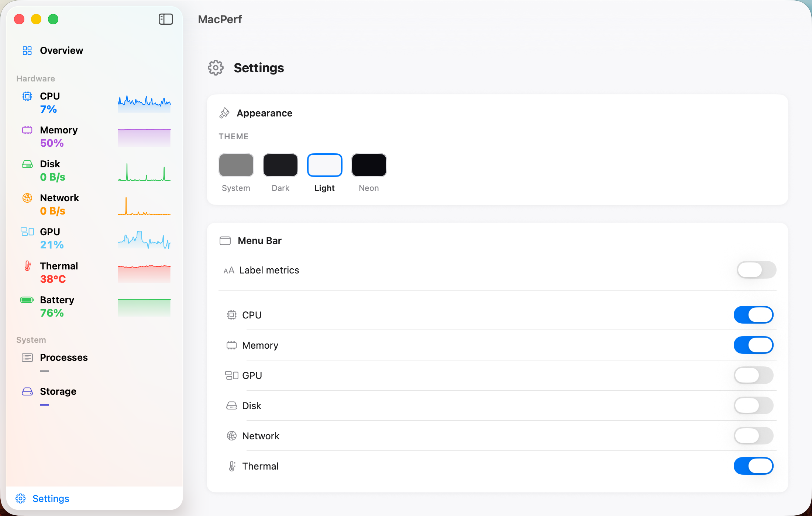
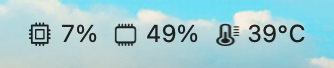

<div align="center">



# MacPerf

A native macOS performance monitor built with SwiftUI.

[](LICENSE)
[](https://www.apple.com/macos/)
[](https://swift.org)

Real-time graphs and metrics for CPU, memory, disk, network, GPU, and thermals — in a main window dashboard and a menu bar dropdown.

</div>

## Screenshots

<p align="center">
  
  <br /><em>Real-time overview dashboard (Dark theme)</em>
</p>

<p align="center">
  
  <br /><em>Live, continuously-updating metrics</em>
</p>

<p align="center">
  
  
  
  <br /><em>Per-metric detail views — CPU, GPU, Disk</em>
</p>

<p align="center">
  
  
  <br /><em>Light theme and settings</em>
</p>

<p align="center">
  
  <br /><em>At-a-glance metrics in the menu bar</em>
</p>

## Features

- **CPU** — Per-core utilization, system / user / idle breakdown
- **Memory** — Active, wired, compressed, cached breakdown with accurate pressure gauge
- **Disk** — Read/write throughput
- **Network** — Upload / download bandwidth
- **GPU** — Utilization and temperature
- **Thermal** — CPU/GPU temperatures via HID sensors (Apple Silicon) and SMC (Intel)
- **Processes** — Top processes by CPU / memory usage with tree view
- **Battery** — Charge level, charging state, time-to-full / time-to-empty (when present)
- **Storage** — Per-volume capacity and I/O
- **Menu bar dropdown** — Quick-glance metrics that float over fullscreen apps
- **Themes** — Dark, Light, Neon
- **Export** — CSV / JSON for the current session's metric history

## Requirements

- macOS 14.0+
- Apple Silicon or Intel

## Install

Download the latest signed and notarized `.dmg` from the [Releases page](https://github.com/thefinder808/macperf/releases/latest), open it, and drag **MacPerf** into your Applications folder.

That's the only manual download you'll ever need — from v1.2.0 on, MacPerf keeps itself up to date automatically (**MacPerf → Check for Updates…** to check on demand; updates are signed and verified end-to-end).

## Build from source

```bash
swift build
swift run MacPerf
```

Requires Swift 5.9+.

## Build the disk image

```bash
./build-dmg.sh
```

Produces a signed, notarized, and stapled `dist/MacPerf-<version>.dmg`. Signing uses your **Developer ID Application** identity (auto-detected from the keychain); notarization uses a credential profile stored in the keychain via a one-time setup:

```bash
xcrun notarytool store-credentials macperf-notary
```

For an unsigned local build, run `MACPERF_UNSIGNED=1 ./build-dmg.sh`.

## License

[MIT](LICENSE) © Nathaniel Graham
